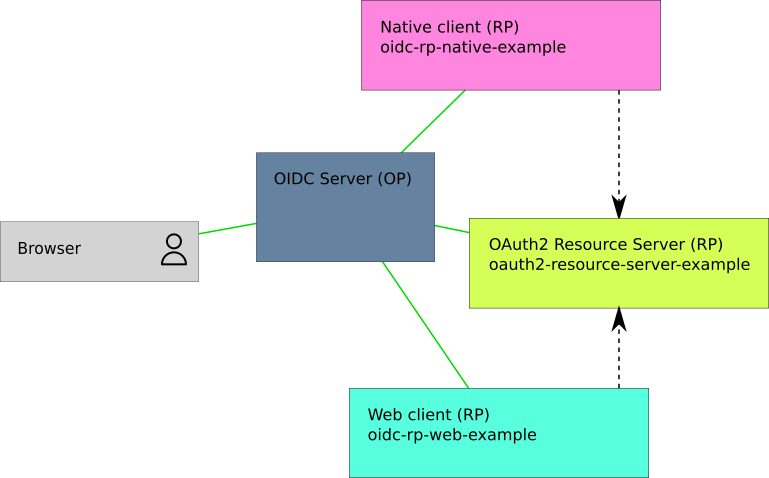

oidc-rp-native-example
======================

[](https://travis-ci.org/madarche/oidc-rp-native-example)

OpenID Connect Relying Party (RP) *native client* (like a mobile app) example

:warning: Native clients specifics: While this project is a demo of a *native
client* it is implemented as a web application. It's not an error. This is done
on purpose to ease its installation and usage, but its  settings are those of a
*native client*.


Architecture
------------

This example needs an OIDC Server (OP) and optionnaly an OAuth2 Resource Server
(https://github.com/madarche/oauth2-resource-server-example).




Usage
-----

It is assumed that this application will run as
https://oidc-rp-native-example.local.test/. One can change this URL with whatever
other URL.

First, write the `config.tom` config file:

```shellsession
cp config.toml.example config.toml
vim config.toml
```

Next, register the RP in the OP with the following properties:

* `client_id` : the same as the `client_id` set in the `config.toml`
* `redirect_uris` : `https://oidc-rp-native-example.local.test/logged_in`
* `post_logout_redirect_uris` : `https://oidc-rp-native-example.local.test/logged_out`

Native clients specifics: No client_secret

* `application_type` : `native`
* `token_endpoint_auth_method` : `none`

Then, install the needed packages and start the application:

```shellsession
npm ci
npm start
```

Finally, visit the application at https://oidc-rp-native-example.local.test/


### When the OP uses self-signed certificate

If the OP uses a self-signed certificate, one gets the following error:
```
RequestError: self signed certificate
```

The solution is, prior to the  `npm start` command, to specify the certificate
to Node.js, for example:

```shellsession
export NODE_EXTRA_CA_CERTS=/etc/nginx/ssl/cert/local.test.crt
```
